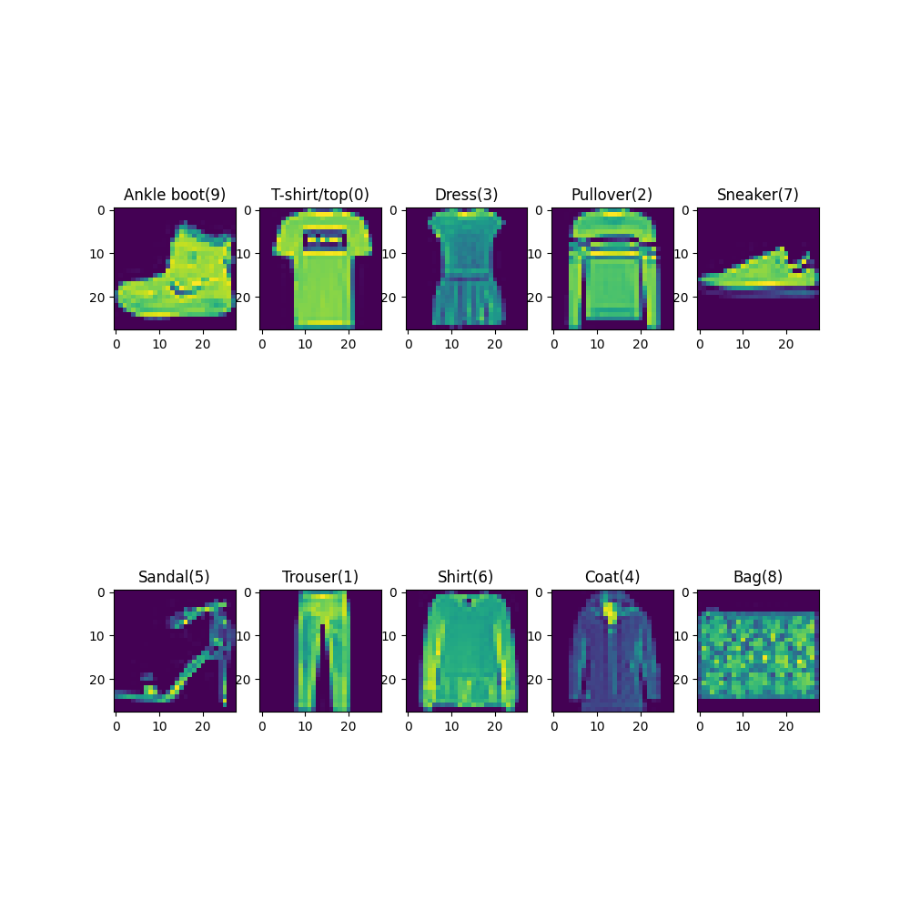
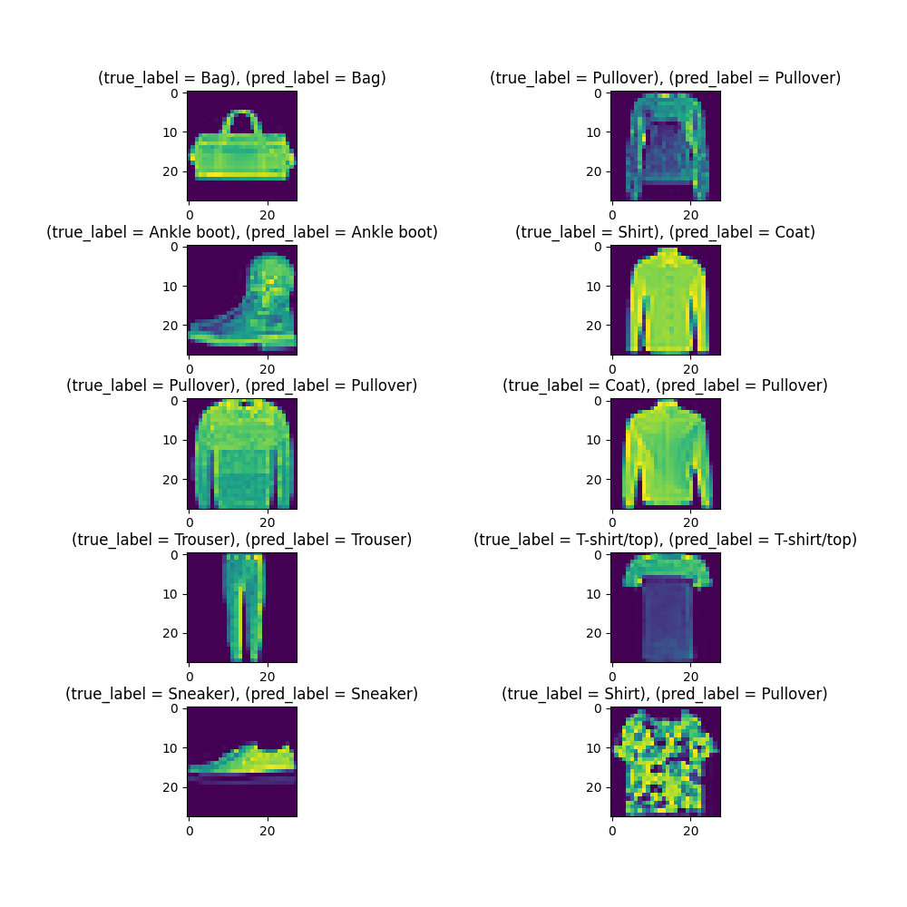

# Deep Learning Classification Project

This repository contains a deep learning project that focuses on a classification task. The model is implemented using PyTorch from scratch, without the use of any Pytorch Neural Net models.

## Table of Contents

1. Introduction
2. Installation
3. Usage
4. Contributing
5. License

## Introduction

### MNIST Fashion Dataset

The MNIST Fashion dataset is a widely used benchmark dataset in the fields of machine learning and computer vision. 
It serves as an extension of the original MNIST dataset, providing grayscale images of various fashion items instead of handwritten digits.

### Overview

- **Contents**: The dataset consists of grayscale images of fashion items such as shirts, pants, shoes, and dresses.
- **Image Size**: Each image is represented as a 28x28 pixel grayscale image, totaling 784 pixels.
- **Classes**: There are 10 classes in total, each representing a different type of clothing.
- **Size**: MNIST Fashion contains 60,000 training images and 10,000 testing images.
- **Labeling**: Each image is labeled with one of the 10 classes, facilitating supervised learning tasks like image classification.


### Usage

The MNIST Fashion dataset is commonly used for tasks such as image classification, pattern recognition, and benchmarking machine learning algorithms.
It serves as an excellent starting point for experimenting with various machine learning models, particularly for beginners due to its simplicity and accessibility.

## Installation

### Prerequisites

- Python 3.7+
- PyTorch 1.8.0+

### Steps

1. Clone the repository:
```bash
git clone https://github.com/MehranMorabiPazoki/fashion-mnist.git
```
2. Install the dependencies:
```bash
pip install -r requirements.txt`
```
## Usage
You'll find learning configurations in the `config/config.yaml` file, which you can customize to your preferences. 
After making any changes, simply execute `python main.py` to initiate the training process. 
This will automatically generate a directory named `runs/train`, housing useful logs from the training session. 
To view training metrics, open a TensorBoard session within this directory.
You can monitor each training session separately on its own board.

## Result
After completing 10 epochs of training, the following result on test data has been obtained.

## License

This project is licensed under the MIT License. See the LICENSE file for details.


